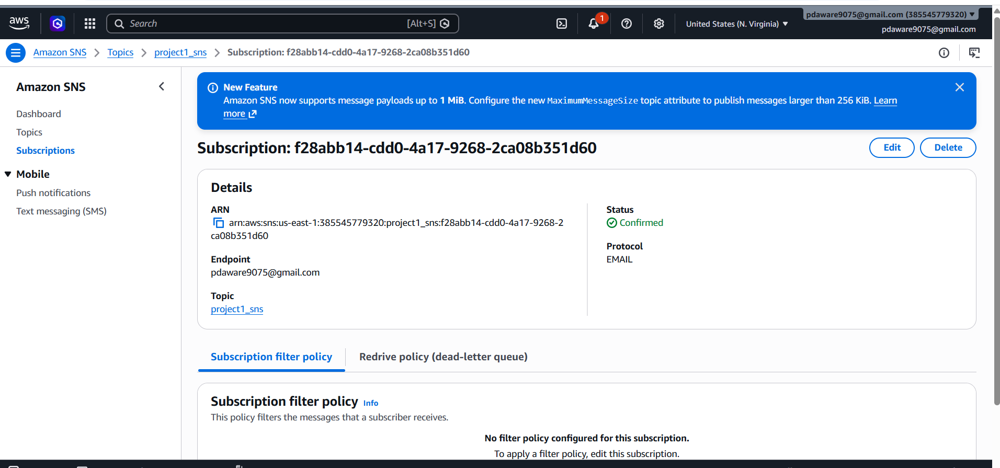
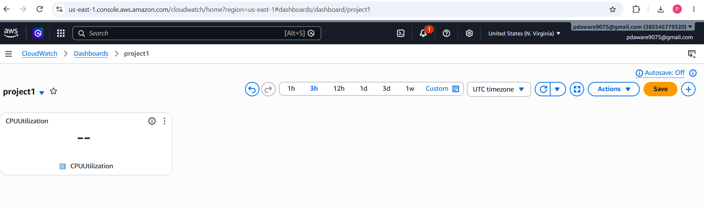
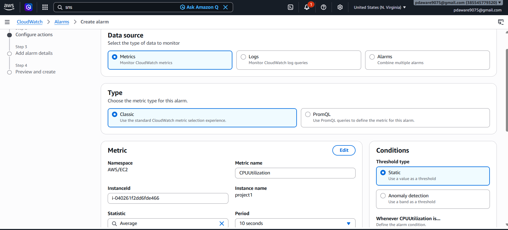
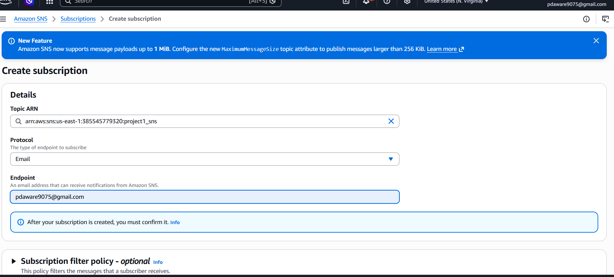
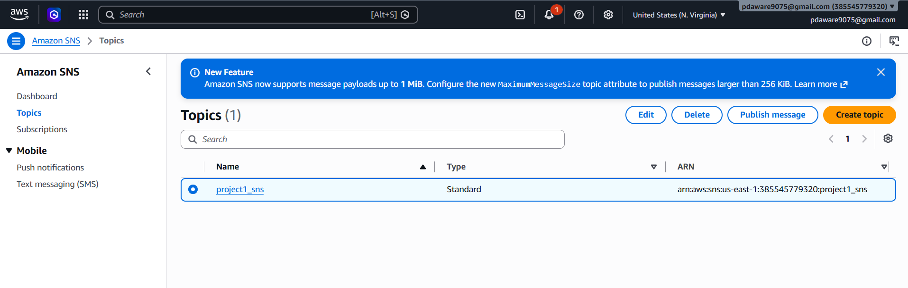
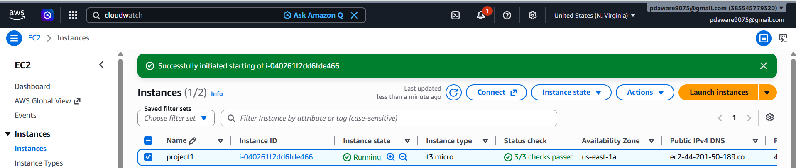
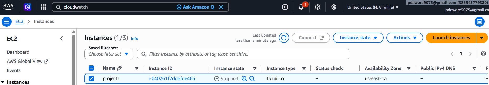
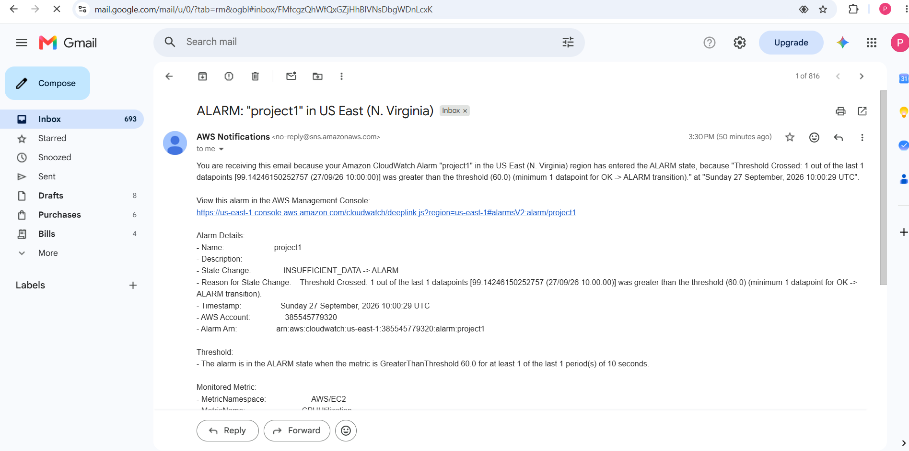
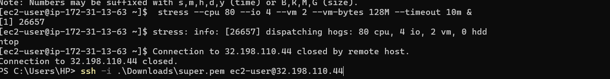

# AWS Project 1 - CloudWatch Monitoring with SNS

## Objective

The objective of this project is to monitor an Amazon EC2 instance using Amazon CloudWatch.

The project monitors:
- CPU Utilization
- EC2 Instance Health

A CloudWatch alarm is created for high CPU utilization.

When CPU utilization crosses the configured threshold, the CloudWatch alarm changes to ALARM state and Amazon SNS sends an email notification.

## AWS Services Used

1. Amazon EC2
2. Amazon CloudWatch
3. Amazon SNS

## Architecture

EC2 Instance
      |
      v
CloudWatch
      |
      v
CPU Utilization
      |
      v
    Alarm
      |
      v
   SNS Topic (Subscription)
      |
      v
Email Notification

## EC2 Configuration

Instance Name: project1

AMI: Amazon Linux

Region: us-east-1

## CloudWatch Configuration

Metric: CPUUtilization

Statistic: Average

Threshold: 60%

Period: 20 secound

## SNS Configuration

Topic Name: EC2-High-CPU-Alert

Protocol: Email

Subscription: Confirmed

## Testing

CPU load was generated on the EC2 instance using the stress command.

Command used:

stress --cpu 80 --io 4 --vm 2 --vm-bytes 128M --timeout 10m &

The CPU utilization increased.

SNS then sent an email notification.

## Result

The EC2 instance was successfully stop

The high CPU alarm was successfully triggered.

SNS successfully sent an email notification.

1)# AWS Project 1 - CloudWatch Monitoring with SNS

## Objective

The objective of this project is to monitor an Amazon EC2 instance using Amazon CloudWatch.

The project monitors:
- CPU Utilization
- EC2 Instance Health

A CloudWatch alarm is created for high CPU utilization.

When CPU utilization crosses the configured threshold, the CloudWatch alarm changes to ALARM state and Amazon SNS sends an email notification.

## AWS Services Used

1. Amazon EC2
2. Amazon CloudWatch
3. Amazon SNS

## Architecture

EC2 Instance
      |
      v
CloudWatch
      |
      v
CPU Utilization
      |
      v
CloudWatch Alarm
      |
      v
SNS Topic
      |
      v
Email Notification

## EC2 Configuration

Instance Name: cloudwatch-demo

AMI: Amazon Linux

Region: ap-south-1

## CloudWatch Configuration

Metric: CPUUtilization

Statistic: Average

Threshold: 70%

Period: 5 minutes

## SNS Configuration

Topic Name: EC2-High-CPU-Alert

Protocol: Email

Subscription: Confirmed

## Testing

CPU load was generated on the EC2 instance using the stress command.

Command used:

stress --cpu 80 --io 4 --vm 2 --vm-bytes 128M --timeout 10m &

The CPU utilization increased.

When the CPU crossed the configured threshold, the CloudWatch alarm changed to ALARM state.

SNS then sent an email notification.

## Result

The EC2 instance was successfully monitored using CloudWatch.

The high CPU alarm was successfully triggered.

SNS successfully sent an email notification.
# AWS Project 1 - CloudWatch Monitoring with SNS

## Objective

The objective of this project is to monitor an Amazon EC2 instance using Amazon CloudWatch.

The project monitors:
- CPU Utilization
- EC2 Instance Health

A CloudWatch alarm is created for high CPU utilization.

When CPU utilization crosses the configured threshold, the CloudWatch alarm changes to ALARM state and Amazon SNS sends an email notification.

## AWS Services Used

1. Amazon EC2
2. Amazon CloudWatch
3. Amazon SNS

## Architecture

EC2 Instance
      |
      v
CloudWatch
      |
      v
CPU Utilization
      |
      v
CloudWatch Alarm
      |
      v
SNS Topic
      |
      v
Email Notification

## EC2 Configuration

Instance Name: cloudwatch-demo

AMI: Amazon Linux

Region: ap-south-1

## CloudWatch Configuration

Metric: CPUUtilization

Statistic: Average

Threshold: 70%

Period: 5 minutes

## SNS Configuration

Topic Name: EC2-High-CPU-Alert

Protocol: Email

Subscription: Confirmed

## Testing

CPU load was generated on the EC2 instance using the stress command.

Command used:

stress --cpu 80 --io 4 --vm 2 --vm-bytes 128M --timeout 10m &

The CPU utilization increased.

When the CPU crossed the configured threshold, the CloudWatch alarm changed to ALARM state.

SNS then sent an email notification.

## Result

The EC2 instance was successfully monitored using CloudWatch.

The high CPU alarm was successfully triggered.

SNS successfully sent an email notification.

# AWS Project 1 - CloudWatch Monitoring with SNS

## Objective

The objective of this project is to monitor an Amazon EC2 instance using Amazon CloudWatch.

The project monitors:
- CPU Utilization
- EC2 Instance Health

A CloudWatch alarm is created for high CPU utilization.

When CPU utilization crosses the configured threshold, the CloudWatch alarm changes to ALARM state and Amazon SNS sends an email notification.

## AWS Services Used

1. Amazon EC2
2. Amazon CloudWatch
3. Amazon SNS

## Architecture

EC2 Instance
      |
      v
CloudWatch
      |
      v
CPU Utilization
      |
      v
CloudWatch Alarm
      |
      v
SNS Topic
      |
      v
Email Notification

## EC2 Configuration

Instance Name: cloudwatch-demo

AMI: Amazon Linux

Region: ap-south-1

## CloudWatch Configuration

Metric: CPUUtilization

Statistic: Average

Threshold: 70%

Period: 5 minutes

## SNS Configuration

Topic Name: EC2-High-CPU-Alert

Protocol: Email

Subscription: Confirmed

## Testing

CPU load was generated on the EC2 instance using the stress command.

Command used:

stress --cpu 80 --io 4 --vm 2 --vm-bytes 128M --timeout 10m &

The CPU utilization increased.

When the CPU crossed the configured threshold, the CloudWatch alarm changed to ALARM state.

SNS then sent an email notification.

## Result

The EC2 instance was successfully monitored using CloudWatch.

The high CPU alarm was successfully triggered.

SNS successfully sent an email notification.

