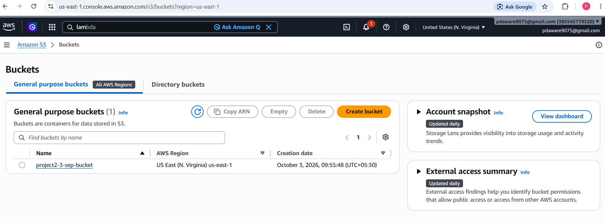
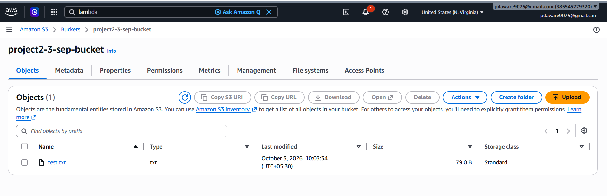
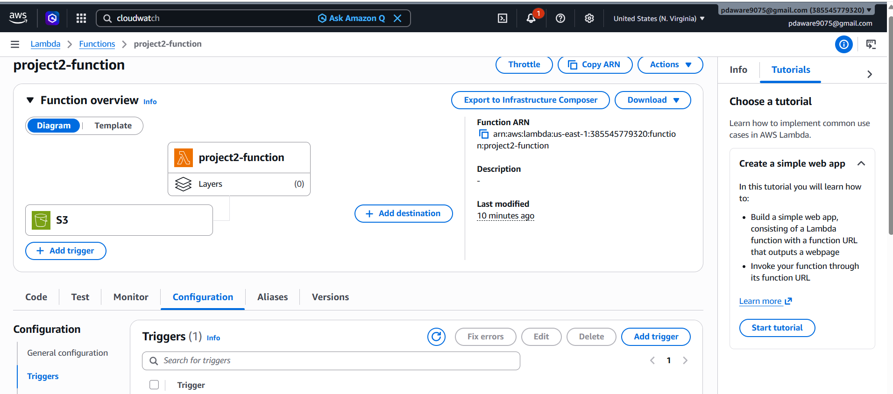
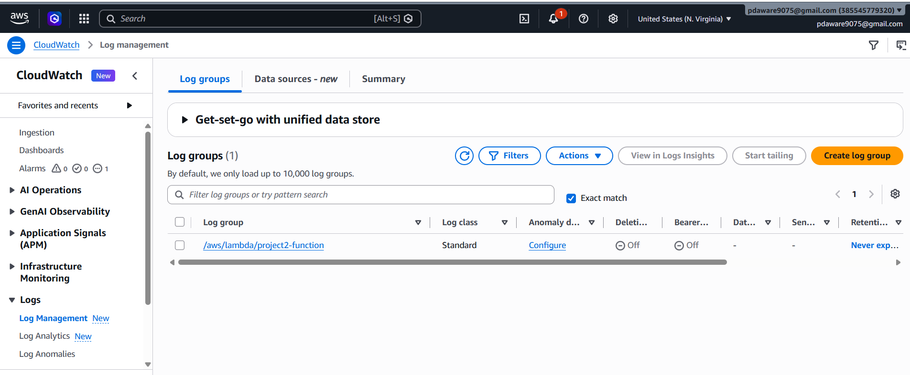
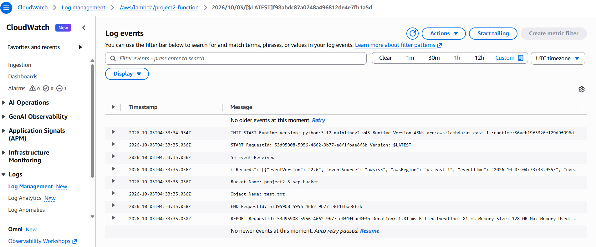

# AWS Project 2 - S3 and Lambda

## Objective

Create an event-driven AWS solution using Amazon S3 and AWS Lambda.

## AWS Services Used

- Amazon S3
- AWS Lambda
- Amazon CloudWatch

## Event Flow

S3 Bucket
    ↓
File Upload
    ↓
Lambda Function
    ↓
CloudWatch Logs

## Lambda Function

The Lambda function captures the S3 bucket name and uploaded object name.

## Testing

Upload test.txt to the S3 bucket.

The S3 event triggers the Lambda function automatically.

The bucket name and object name are displayed in CloudWatch Logs.

## Expected Output

S3 Event Received
Bucket Name: project2-3-sep-bucket
Object Name: test.txt

## Result

The S3 to Lambda event-driven solution was successfully configured and tested.

## 1. Create S3 Bucket

## 2. Upload File to S3 Bucket

## 3. Create Lambda Function

## 4. CloudWatch Log Group

## 5. CloudWatch Log Details
