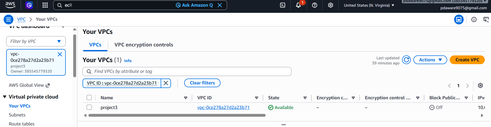
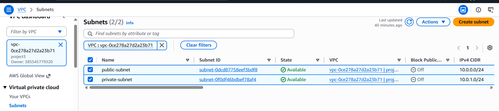
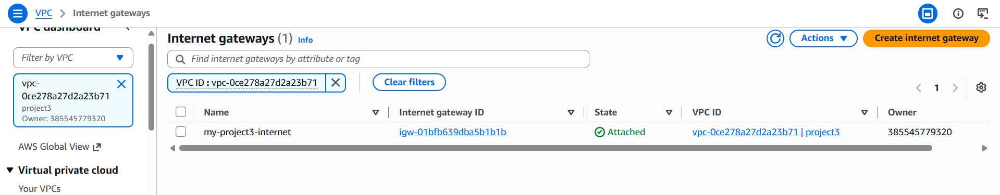
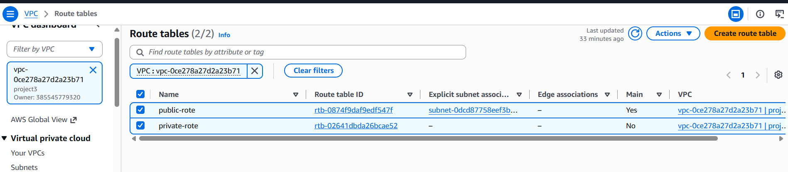
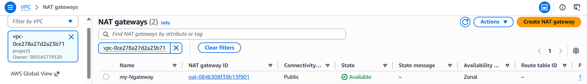
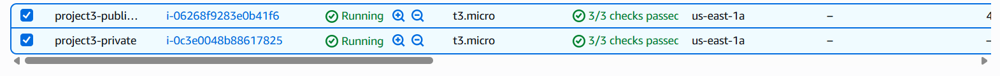
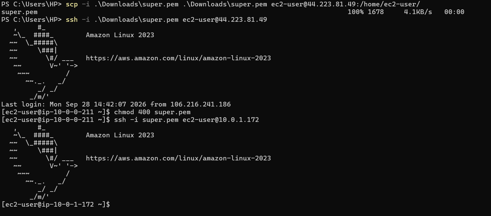

# AWS Project 3 - Secure VPC with Public and Private Subnets

## 1. Project Objective

The objective of this project is to create a secure AWS VPC environment with public and private subnets.

The project includes:

- Custom VPC
- Public Subnet
- Private Subnet
- Internet Gateway
- NAT Gateway
- Public Route Table
- Private Route Table
- Public EC2 Instance
- Private EC2 Instance
- Connectivity Testing

---

## 2. AWS Services Used

- Amazon VPC
- Amazon EC2
- Internet Gateway
- NAT Gateway
- Route Tables
- Security Groups

---

## 3. VPC Configuration

VPC Name:

`project3`

VPC CIDR:

`10.0.0.0/20`

---

## 4. Public Subnet

Subnet Name:

`public-subnet`

CIDR:

`10.0.1.0/24`

The public subnet is connected to the Internet through the Internet Gateway using the Public Route Table.

---

## 5. Private Subnet

Subnet Name:

`private-subnet`

CIDR:

`10.0.2.0/24`

The private subnet does not have direct access to the Internet Gateway.

Internet access for resources in the private subnet is provided through the NAT Gateway.

---

## 6. Internet Gateway

Internet Gateway Name:

`my-project3-internet`

The Internet Gateway is attached to the VPC.

The Public Route Table uses the Internet Gateway as the target for Internet traffic.

Route:

`0.0.0.0/0 → Internet Gateway`

---

## 7. NAT Gateway

NAT Gateway Name:

`my-Ngateway`

The NAT Gateway is created in the Public Subnet.

Connectivity Type:

`Public`

The NAT Gateway allows resources in the Private Subnet to access the Internet for outbound connections.

---

## 8. Public Route Table

Route Table Name:

`public-rote`

Route:

`0.0.0.0/0 → Internet Gateway`

Subnet Association:

`public-subnet`

---

## 9. Private Route Table

Route Table Name:

`private-rote`

Route:

`0.0.0.0/0 → NAT Gateway`

Subnet Association:

`private-subnet`

---

## 10. Public EC2 Instance

EC2 Name:

`project3-public-ec2`

Subnet:

`public-subnet`

Public IP:

`Enabled`

The Public EC2 instance is used to test direct Internet connectivity.

---

## 11. Private EC2 Instance

EC2 Name:

`project3-private`

Subnet:

`private-subnet`

Public IP:

`Disabled`

The Private EC2 instance does not have a public IP address.

It uses the NAT Gateway for outbound Internet connectivity.

---

## 12. Architecture


                         INTERNET
                            |
                            |
                   Internet Gateway
                            |
                     Public Subnet
                            |
                       Public EC2
                            |
                      NAT Gateway
                            |
                    Private Subnet
                            |
                       Private EC2


                      
                      
## SSH Login and Connectivity Testing
### 1. SSH Login to Public EC2

The Public EC2 instance was accessed using SSH.

Command:

```bash
ssh -i super.pem ec2-user@PUBLIC-IP
exit
scp -i ".\Download\super.pem .\Download\super.pem ec2-user@PUBLIC-IP:/home/ec2-user/
ssh -i ".\super.pem" ec2-user@PUBLIC-IP
chmod 400 super.pem
ssh -i super.pem ec2-user@Private-IP


## Final Result

The AWS VPC environment was successfully created and configured with Public and Private Subnets.

The Internet Gateway was successfully configured for the Public Subnet.

The NAT Gateway was successfully configured in the Public Subnet to provide outbound Internet access to the Private Subnet.

The Public EC2 instance was successfully launched and accessed through SSH.

The Private EC2 instance was successfully launched without a Public IP.

SSH connectivity between the Public EC2 and Private EC2 was successfully tested.

Internet connectivity was successfully verified using:

```bash
curl https://example.com
```















